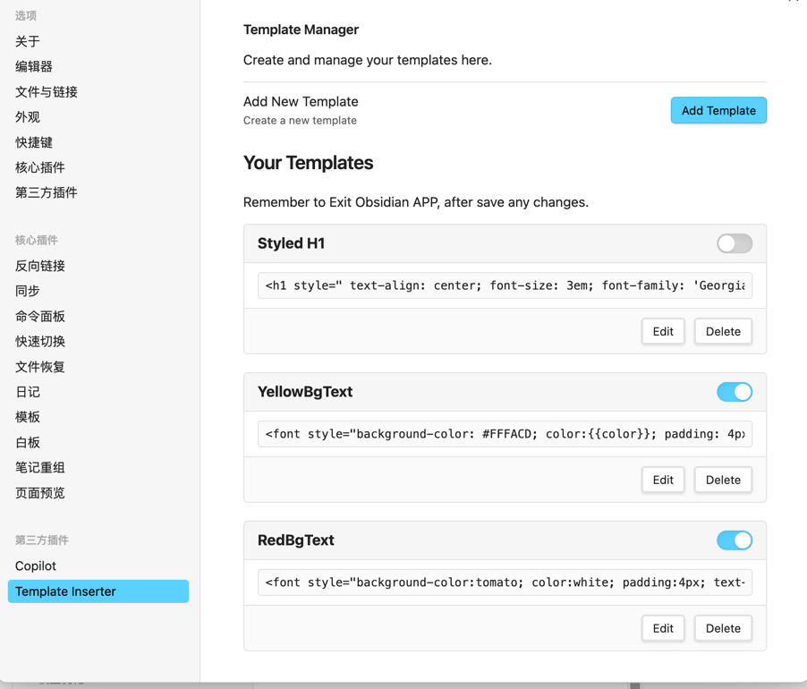
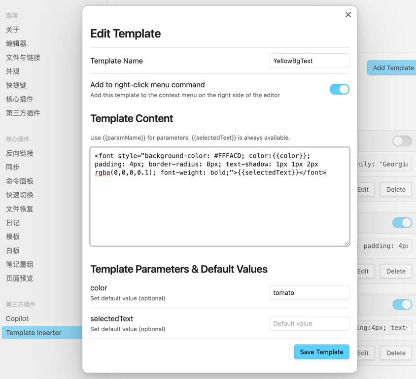
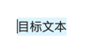
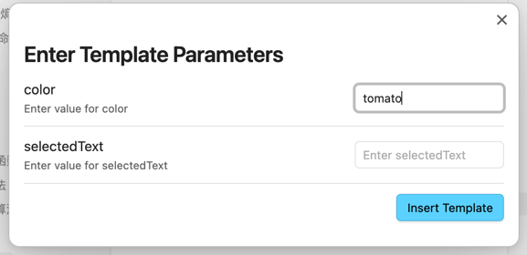
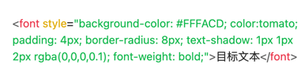
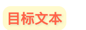

# Mustache Template Formatter


## DEMO 演示

1. Copy main.js, manifest.json, styles.css these three files to the notes project.obsidian/plugins/mustache-template-inserter directory, if this directory does not exist, create one.    
复制main.js, manifest.json, styles.css这三个文件到笔记项目.obsidian/plugins/mustache-template-inserter 目录下，没有这个目录就创建一个。
2. Open Obsidian settings and enable it under the third-party plugins option.  
打开Obsidian设置，在第三方插件选项下启用Template Inserter  

3. Select Template Insert, choose to add or modify templates  
选中Template Insert，选择添加或修改模板

4. Edit one template
- selectedText represents the text selected in the editor  
- Template syntax uses Mustache  

修改模板, 
- selectedText代表在编辑器中选中的文本
- 模板语法使用Mustache

5. Save and exit the Obsidian app, then reopen it.  
保存并退出Obsidian应用，重新打开。
6. Use Template / 使用模板
- 选中目标文本

- command+p 打开命令窗口，选择 Template Insterter: 你的模板，填写参数值，模板生效，替换原文本



## Description:
The **Mustache Template Formatter** plugin allows users to format selected text using the Mustache templating engine and insert the formatted result into the current document. With simple templates and data mapping, users can dynamically generate content, improving text editing efficiency and flexibility. This plugin is particularly useful for users who need to process or automate the insertion of formatted text, such as generating repetitive document structures, form generation, or code comments in programming.

## Key Features:
- **Mustache Templating Support**: Use the Mustache templating engine to define text formatting with dynamic variables and expressions.
- **Text Selection and Insertion**: Select a portion of text in the document, apply a template, and insert the resulting formatted text back into the document.
- **Custom Variables**: Define custom variables and data structures through templates to generate a wide variety of content.
- **Template Library**: Built-in common templates for quick use or user customization.

## Usage Example:
1. **Select Text**: Highlight the text you want to format.
2. **Apply Template**: Use the plugin’s shortcut or command palette to select your desired Mustache template.
3. **Insert Result**: The plugin will format the selected text based on the template and insert the generated result into the document.

**Template Example:**
- `Hello, {{name}}! Today is {{day}}.`  
  Input: `Hello, John! Today is {{day}}.`  
  Output: `Hello, John! Today is Monday.` (assuming `day` is dynamically generated from the current date)

## Installation:
1. Open Obsidian.
2. Go to Settings > Plugins > Community Plugins.
3. Search for "Mustache Template Formatter" and click **Install**.
4. After installation, enable the plugin and use the command palette or set a shortcut to trigger the plugin’s functionality.

## Developer Information:
- **Author**: Your Name
- **GitHub**: [GitHub Repo Link]
- **Version**: 1.0.0
- **Dependencies**: Mustache.js (Templating Engine)

## Plugin Structure:
- `manifest.json`: Metadata for the plugin.
- `main.ts` / `main.js`: Core logic for template parsing and text insertion.
- `README.md`: Instructions and developer documentation.
- `assets/`: Folder containing icons and other assets.

## Contributing:
Feel free to submit issues, feature requests, or code contributions. Please create an issue or submit a pull request on the GitHub repository.

--- 
# 基于Mustache模板的插件

一个[Obsidian](https://obsidian.md)插件，允许你使用Mustache语法和自定义参数对选中文本上色，加style,和其他任意遵守mustache语法的文本格式化（主要是将选中文本格式化为html带样式的语法），然后插入模板内容。

## 特性

- 使用命令插入模板内容
- 通过模板管理器创建和管理多个模板
- 使用Mustache语法配置自定义模板
- 自动在模板中包含选中的文本
- 通过对话框自定义参数

## 使用方法

1. 在编辑器中选择一些文本（可选）
2. 从命令面板运行"Insert template with parameters"命令
3. 从列表中选择要使用的模板
4. 在对话框中填写参数值
5. 点击"Insert Template"将处理后的模板插入到光标位置

## 模板管理器

插件设置中包含一个强大的模板管理器，允许你：

- 创建新模板
- 编辑现有模板
- 重命名模板
- 删除不再需要的模板

每个模板都有一个名称和内容。模板内容使用Mustache语法，可以包含参数和条件逻辑。

## 模板语法

该插件使用[Mustache](https://github.com/janl/mustache.js)进行模板处理。可用变量包括：

- `{{param1}}` - 对话框中的第一个参数
- `{{param2}}` - 对话框中的第二个参数
- `{{selectedText}}` - 运行命令时选择的文本

示例模板：
```
<a href="https://colab.research.google.com/github/jimmy-pink/colab-playground/blob/main/{{param1}}" target="_parent">
    {{#param2 == 'github'}}
    
    {{/param2}}
    
    {{^param2}}
    
    {{/param2}}
<span>{{selectedText}}</span>
</a>
```

## 安装

### 从Obsidian安装

1. 在Obsidian中打开设置
2. 进入社区插件并禁用安全模式
3. 点击浏览并搜索"Template Inserter"
4. 安装插件并启用它

### 手动安装

1. 从GitHub仓库下载最新版本
2. 将ZIP文件解压到Obsidian插件文件夹：`<vault>/.obsidian/plugins/`
3. 在Obsidian的社区插件设置中启用插件

## 开发

1. 将此仓库克隆到您的开发文件夹
2. 使用`npm install`安装依赖项
3. 运行`npm run dev`开始编译并监视更改

## 许可证

本项目采用MIT许可证授权。
